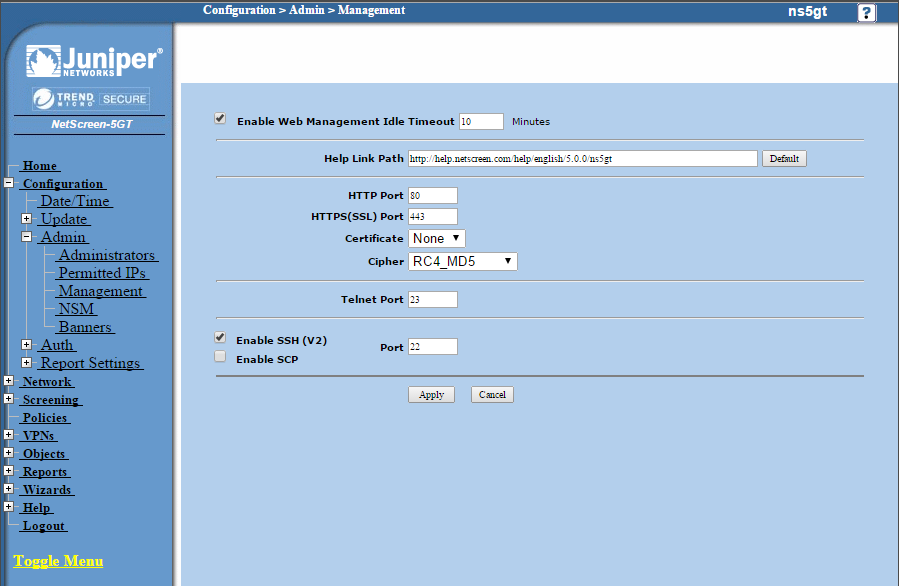
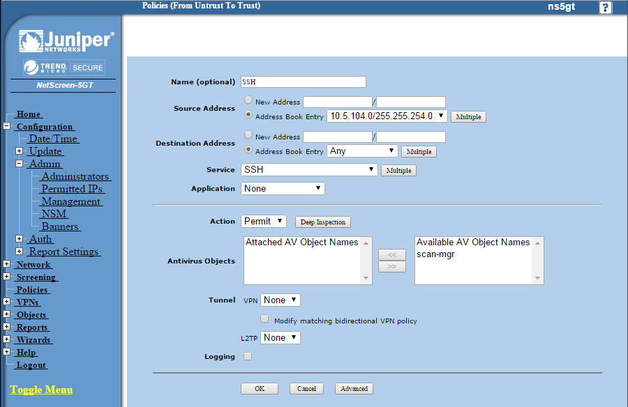
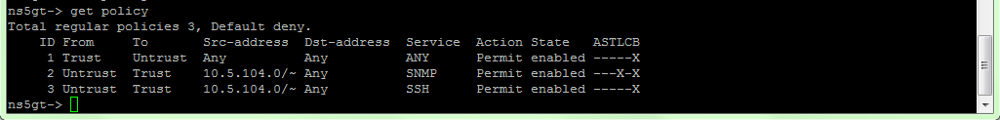

Administration
==============

By default, SSH is disabled on the Juniper Netscreen 5gt, so we have to
enable it.
First, we go to Configuration > Admin > Management and set the tick at
"Enable SSH (v2)", we don't need SCP.

Then, we go to Policies and add new policy, as shown in the following 
two pictures.

Once that's done, we can access the firewall through SSH.

Login:

.. code:: bash

    ssh 5ahit@10.0.100.10

Then we enter our password and we are logged on.

In the following, we elaborate the commands required to do the CRUD
(Create, Read, Update, Delete) operations on the firewall.
Please do note that in our application, the policies are queried via
SNMP, so the read part is simply there for completeness.

Add policy
~~~~~~~~~~

The general syntax is:

.. code:: bash
 
    set policy name %name from %inzone to %outzone %inip %outip %service %action %optional

Variables (those with %):

============== ====================================================================
Variable       Description
============== ====================================================================
%name          Policy name (optional)
%inzone        Inbound zone (e.g. untrusted)
%outzone       Outbound zone (e.g. trusted)
%inip          Inbound IP/Range (e.g. 10.0.0.1/255.255.0.0)
%outip         Outbound IP (e.g. Any, or see %Inip)
%service       The service name (e.g. SSH, FTP, HTTP, ..)
%action        deny, permit, nat, tunnel
%optional      attack, auth, av, count, log, schedule, traffic, url-filter, webauth
============== ====================================================================

Example:

.. code:: bash

    set policy name FTP from untrust to trust 10.5.104.0/255.255.254.0 Any FTP permit

In this example, we add a new policy with the name *FTP*, inbound zone is *untrusted*,
outbound zone *trust*, for requests comming from 10.5.104.0/23 to Any address.
The service is FTP (see router's documentation about pre-defined services) and we allow
all traffic matching this policy. 

Read policies
-------------

To get a list of all currently existing rules, one types:

.. code:: bash

    get policy

This causes an output, as shown in the picture below.

Update policy
~~~~~~~~~~~~~

The command syntax is technically the same (same variables) as described in the add policy
part, with the difference that we specify the id of the policy to edit.

Therefore, the syntax looks as follows:

.. code:: bash

    set policy id %id %parameters

Variables:

============== ========================
Variable       Description
============== ========================
%id            The policy id to update
%parameters    See "Add policy" above
============== ========================

The following example assumes that the command in "Add policy" was run and got the ID 4:

.. code:: bash

    set policy id 4 name Telnet from untrust to trust 10.5.104.0/255.255.254.0 Any Telnet deny

It should be pretty self-explanatory.

Remove policy
~~~~~~~~~~~~~

Removal of existing policies is done through the unset command, its general syntax is:

.. code:: bash

    unset policy id %id

Whereas %id is the policy's unique ID.

To remove the rule created in the first step, the call would look like:

.. code:: bash

    unset policy id 4