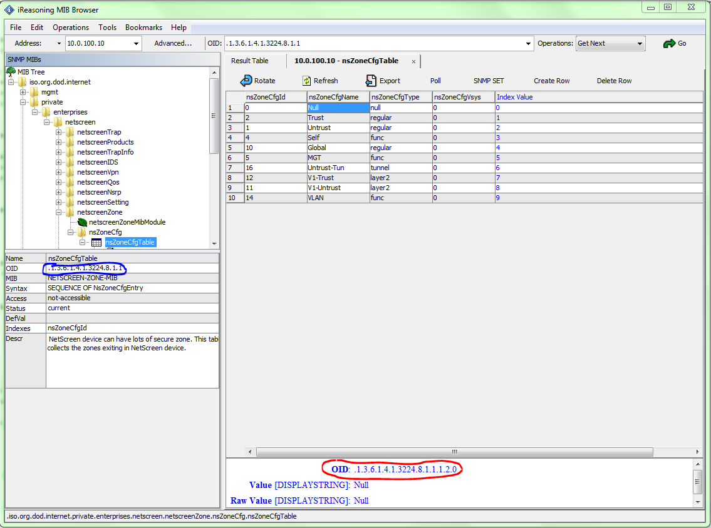

Juniper NetScreen 5GT
=====================

This appilance is EOl since December 31, 2008, therefore we were only able to
find it's description in the user manual, see below.

The Juniper Networks NetScreen-5GT provides IPSec VPN and firewall services for
a broadband telecommuter, a branch office, or a retail outlet. While at the
entry level of the NetScreen appliance product line, the NetScreen-5GT uses the
same firewall, VPN, and traffic management technology as NetScreen’s high-end
central site products.

Juniper Networks offers three versions of NetScreen-5GT:
• The 10-user version supports up to 10 users.
• The Plus version supports an unrestricted number of users.
• The Extended version provides the same capabilities as the Plus version with
additional features: High Availability (NSRP Lite), the DMZ security zone, and
additional sessions and tunnel capacity. [15]

Our appilance uses ScreenOS 5.0.8r2, which is based on FreeBSD.

MIB (Message Information Base)
~~~~~~~~~~~~~~~~~~~~~~~~~~~~~~

In order to get the OIDs (column id's) we downloaded the MIB files for ScreenOS
from the official website and loaded it into the MIBbrowser.

The MIBs can be found here:
http://www.juniper.net/techpubs/software/screenos/mibs.html#5.0.0

We downloaded them for ScreenOS 5.0.0.

And the MIBbrowser:

http://ireasoning.com/mibbrowser.shtml

Then, after unzipping the downloaded ZIP file the MIBs can be loaded into the
MIBbrowser using the File > Load MIBs, by selecting the unpacked files.

Finding the OIDs is described in the next section.

MIBbrowser
~~~~~~~~~~

After loading the MIBs, one can navigate through the tree and select the kind
of information they want, example:

By selecting the column of a row, one can find out the required OIDs to query.
In the above example, the red circle.
The blue circle specifies the OID of the whole table, you rarely want to query
that using a program.

So in our example, to get the first row's second column, you would use:

.. code:: plain

    .1.3.6.1.4.1.3224.8.1.1.1.2.0

Whereas, the last number in the OID (in this example, 0) specifies the row id,
so 1.1.1.2.1 would query the second row.
To get all rows of the second column, it is required to leave it out.

To get back to our example, querying all rows of the "nsZoneCfgName" column,
one would use:

.. code:: plain

    .1.3.6.1.4.1.3224.8.1.1.1.2

In order to change the column, the number before the row id has to be changed,
for example 2 -> 3.

That's basically it, we are going to specify the device specific OIDs for this
device below.

Object IDs
~~~~~~~~~~

Policy:

========================== ===================
OID                        Column name
========================== ===================
1.3.6.1.4.1.3224.10.1.1.1  ID
1.3.6.1.4.1.3224.10.1.1.3  Source zone
1.3.6.1.4.1.3224.10.1.1.4  Destination Zone
1.3.6.1.4.1.3224.10.1.1.5  Source Address
1.3.6.1.4.1.3224.10.1.1.6  Destination Address
1.3.6.1.4.1.3224.10.1.1.7  Service
1.3.6.1.4.1.3224.10.1.1.8  Action
1.3.6.1.4.1.3224.10.1.1.15 Log on/off
1.3.6.1.4.1.3224.10.1.1.24 Name
========================== ===================

Throughput:

========================= ===========
OID                       Column name
========================= ===========
1.3.6.1.4.1.3224.10.2.1.1 Policy ID
========================= ===========

Services:

========================= ===========
OID                       Column name
========================= ===========
1.3.6.1.4.1.3224.13.1.1.2 Name
========================= ===========

Zones:

========================== ===========
OID                        Column name
========================== ===========
1.3.6.1.4.1.3224.8.1.1.1.2 Name
========================== ===========